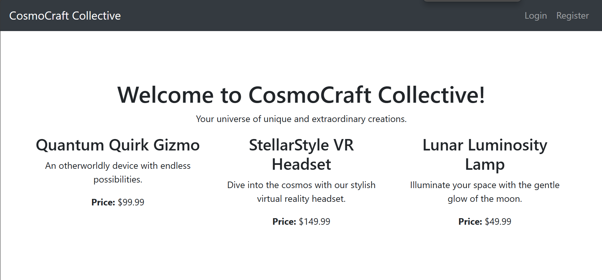
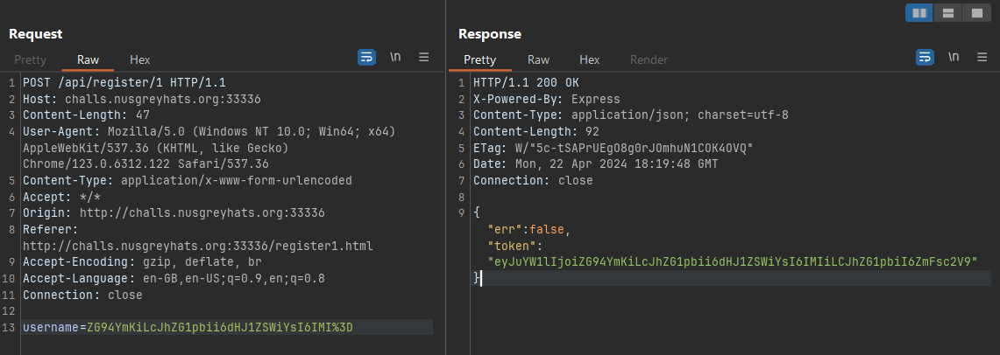
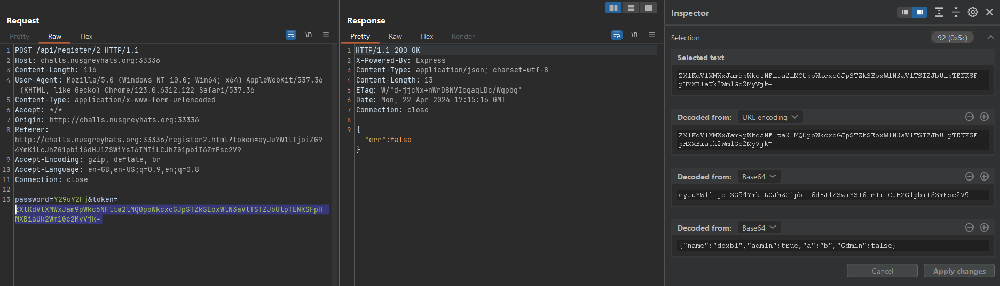
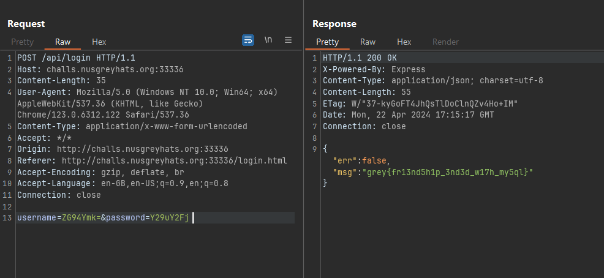

## Overview
:::info Challenge
I asked My friend Jason to build me a new e-commerce website. We just finished the login system and there's already bugs 🤦

Author: jro<br />
[`📁 no-sql-injection.zip`](https://github.com/NUSGreyhats/greyctf24-challs-public/tree/main/quals/web/no-sql-injection/distribution)<br />
[`🔖 SQL Injection`](/tags/SQLi/1)
:::

- Web có hai chức năng cơ bản là Register là Login
- Data nhập vào sẽ được convert và lưu dưới dạng base64
- Register phải qua hai lần xử lý là `register/1` để lưu token và `register/2` để lưu username từ token và password. Mặc định sẽ là `"admin": false`
- Khi login, web sẽ check nếu username tương ứng là admin thì trả về flag.

Giả sử khi register với username là `doxbi`, username sẽ được đưa vào JSON và encode sang base64, sau đó lưu vào table `tokens`
```javascript
app.post('/api/register/1', async (req, res) => {
  ...
  const token = btoa(JSON.stringify({
    name: username,
    admin: false
  }));
  await query("insert into tokens values (?)", [token]);
  res.json({ "err": false, "token": token });
  ...
})
```
Sau đó ta cần nhập password và token được trả về ở bước đầu để POST lên `/api/register/2` để lưu username và password
```javascript
app.post('/api/register/2', async (req, res) => {
  ...

  const result = await query("select 1 from tokens where token = ?", [token]);
  if (result.length != 1) {
    return res.json({ err: "Token not found!" });
  }

  ...

  const { name, admin } = JSON.parse(atob(token));
  await query("insert into users (name, password, admin) values (?, ?, ?)", [name.toString(), password, admin === true]);

  res.json({ "err": false });
})
```
## Idea
Ở đây, code sẽ check token có tồn tại trong database không và lấy username, admin từ token để lưu vào table `users`.
Với bài này, ta cần phải tìm cách thay đổi admin của token thành true để lấy được flag khi login. 
Điểm đặc biệt của bài này là lưu trữ dữ liệu trong database dưới dạng base64. Tuy nhiên khi so sánh bằng thì MySQL lại không phân biệt hoa thường, tức là `'a' = 'A'`. Mà base64 lại không như thế, decode `AAAA` và `aaaa` sẽ cho ra hai kết quả khác nhau. Ta có thể tận dụng việc này để bypass việc check token từ database và thay đổi admin thành true. 

## Solution
Đăng ký với username là `doxbi`, ta sẽ được token như sau
```json
{"name":"doxbi","admin":false}
```
Ta cần inject vào username để có thể set admin thành true
```json
{"name":"doxbi","admin":true,"a":"b","admin":false}

eyJuYW1lIjoiZG94YmkiLCJhZG1pbiI6dHJ1ZSwiYSI6ImIiLCJhZG1pbiI6ZmFsc2V9
```
Mình sẽ thay đổi một số ký tự hoa <-> thường, thay thế dấu nháy với kí tự khác để inject vào username
```json
{"name":"doxbb¢-Âadmin(ºtrue%¢bÂ: Â","admin":false}

eyJuYW1lIjoiZG94YmKiLcJhZG1pbii6dHJ1ZSWiYsI6IMIiLCJhZG1pbiI6ZmFsc2V9
```
Tới đây vẫn còn vấn đề nhỏ với key `admin` ở cuối, nó sẽ ghi đè lên key `admin` ta thêm vào, ta chỉ cần thay đổi key với cách tương tự như trên
```json
{"name":"doxbb¢-Âadmin(ºtrue%¢bÂ: Â","Gdmin":false}

eyJuYW1lIjoiZG94YmKiLcJhZG1pbii6dHJ1ZSWiYsI6IMIiLCJHZG1pbiI6ZmFsc2V9
```


Cụ thể, mình cần phải đăng ký với username là `doxbb¢-Âadmin(ºtrue%¢bÂ: Â`. Token `eyJuYW1lIjoiZG94YmKiLcJhZG1pbii6dHJ1ZSWiYsI6IMIiLCJhZG1pbiI6ZmFsc2V9` sẽ được lưu vào trong table. 

Sau khi token được lưu vào database, ta POST lên `/register/2` với token đã được chỉnh sửa để set admin thành true.

Khi MySQL compare vẫn sẽ trả về 1, nhưng khi decode base64 sẽ ra name=doxbi, admin=true và lưu vào table.
Giờ chỉ cần login với username là `doxbi` và password để lấy flag
