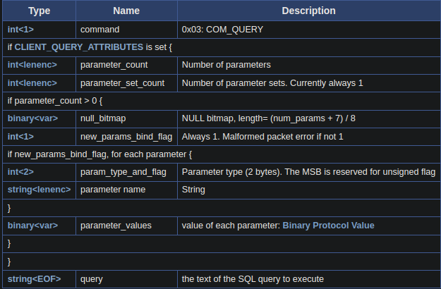

## Overview
Normal communication to MySQL server has two phases:
- **Connection phase** where capabilities and authentication data are exchanged
- **Query phase** accepts commands from the client and executes them

When a connection is established the server initiates a Connection Phase. Then it enters the Command Phase. The Command Phase ends when the connection terminates.

(We can ignore the ReplicationMode here)

### MySQL Packets
If a MySQL client or server wants to send data, it:
- Splits the data into packets of size $2^{24}$ bytes
- Prepends to each chunk a packet header

| Type        | Name           | Description                                                   |
|-------------|----------------|---------------------------------------------------------------|
| int<3>      | payload_length | Length of the payload                                         |
| int<1>      | sequence_id    | sequence id, start at 0 and reset to 0 when begin new command |
| string\<var> | payload        | Payload of the packet                                         |

    
Therefore, every payload must start with 4 bytes, 3 bytes length and 1 byte sequence_id (usually `0x00`)
    
## Connection Phase
At this phase, the client and server will exchange the capabilities of each other (the server sends information that contains the protocol version, database version,...). The client also provide credential to authenticate in this phase. If successful, the server will respond `OK_PACKET`.
    
When connected, server will send [Protocol::Handshake](https://dev.mysql.com/doc/dev/mysql-server/latest/page_protocol_connection_phase_packets_protocol_handshake.html) (Initial Handshake), since 3.21.0, server will use protocol version 10.

This packet contains server information and `auth_plugin_name` which is usually `mysql_native_password`

After receiving the Server Initial Handshake Packet, the client will respond [Protocol::HandshakeResponse41](https://dev.mysql.com/doc/dev/mysql-server/latest/page_protocol_connection_phase_packets_protocol_handshake_response.html) with credentials for authenticating, here I use Plain Handshake so the SSL Connection can be skipped.

Here the payload when I tried to connect MySQL with username `user_OWxsp`, database `db_z0lKy` and no password.

- First 4 bytes `78 00 00 00 01`: Payload length and sequence id (sequence_id = 0 is Server Inital Handshake)
- 4 bytes `8d a2 1a 00`: [Capabilities Flags](https://dev.mysql.com/doc/dev/mysql-server/latest/group__group__cs__capabilities__flags.html), hex value is 0x001aa28d, it can be converted to 32 bits `0000 0000 0001 1010 1010 0010 1000 1101` to check which flag is enable.
- 4 bytes `00 00 00 c0`: Max packet size, which is 192
- 1 byte `2d`: Character set, 0x2d = 45 (which corresponds to utf8mb4_general_ci)

- 23 bytes `00 00 .. 00 00`: Just a filler with 23 bytes 0x00
- 11 bytes `75 73 65 72 5f 4f 57 78 73 70 00`: Username and nullbyte for terminating
- 1 byte `00` (CLIENT_PLUGIN_AUTH_LENENC_CLIENT_DATA): Auth response (no auth response)
- 9 bytes `64 62 5f 7a 30 6c 4b 79 00` (CLIENT_CONNECT_WITH_DB): Database name and nullbyte
- 22 bytes `6d 79 .. 72 64 00` (CLIENT_PLUGIN_AUTH): The authentication method and nullbyte, I use `mysql_native_password`
- 46 bytes `2c 0c .. 2e 31`:
    - 1 byte `2c`: Length of all attributes
    - 13 bytes `0c 5f 63 6c 69 65 6e 74 5f 6e 61 6d 65`: 1 byte length and key (`_client_name`)
    - 8 bytes `07 6d 79 73 71 6c 6e 64`: 1 byte length and value (`mysqlnd`)
    ...

In summary, in the Connection phase:
1. Client connect to Server
2. Server send Protocol::Handshake
3. Client responds with Protocol::HandshakeResponse
4. Client and server possibly exchange further packets as required by the server authentication method for the user account the client is trying to authenticate against.
5. Server responds with OK_PACKET if successful
    
## Command Phase
Our query statement will be here. The commands can be one of 4 sub-protocols:
- Text Protocol
- Utility Commands: connection close, ping, debug,...
- Prepared Statements: for prepare statement
- and Stored Programs.
    
I will focus on the `Text Protocol` because it's used to send SQL queries easily.
#### Text Protocol

Example with easy query `SELECT "test";`

- First 4 bytes `0f 00 00 00`: Payload length and sequence id
- 1 byte `03`: Always 03 in COM_QUERY, Text Protocol
- Final 14 bytes: My query, which is `SELECT "test";`
    
If it were sent successfully, the Server would respond with a packet return value of the query.

#### Prepare Statement
Another way to send SQL queries is using Prepare Statement, but it's more complex than Text Protocol.
Firstly, we need to send `COM_STMT_PREPARE` and then wait for the server to respond. We need to decode that response to get `statement_id`. Finally, we will `COM_STMT_EXECUTE` with `statement_id` from the previous.
    
## Quit
After done, we can send `COM_QUIT` (Utility Commands) whose payload contains only 1 byte `01`

##
The idea came from a CTF challenge in which I had to craft a TCP payload to query the MySQL database to the flag. I solved this by using the `tcpdump` command to get raw payload requests to MySQL, I want to know how the payload is generated, so I am writing this blog.
My script (gopherus use python2...): [Github](https://github.com/dAd0qbu/db-tcp-gen/)

##
- [https://dev.mysql.com/doc/dev/mysql-server](https://dev.mysql.com/doc/dev/mysql-server)