PicoCTF2024 là giải Weekly đầu tiên trong năm 2024 của CLB và cũng có thể xem là giải debut của team mình dù đã hoạt động từ lâu. Dù không thể giải quyết hết tất cả các challenge nhưng KHÔNG QUAN TRỌNG 💣💥💥, bọn mình cũng đã cố gắng hết sức.

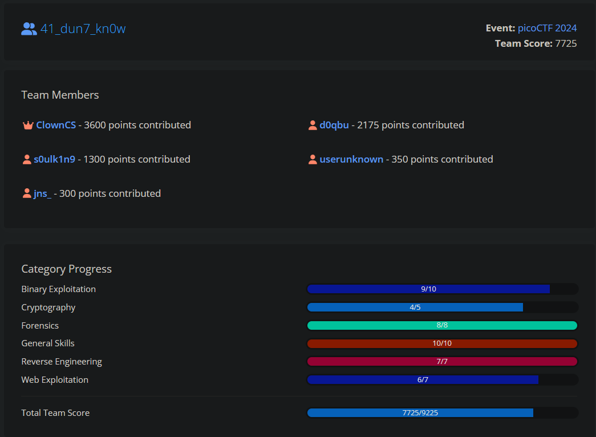

Dưới đây là writeup của một số bài trong PicoCTF

## GENERAL: binhexa
:::info Challenge
How well can you perfom basic binary operations?
Start searching for the flag here `nc titan.picoctf.net`
:::
Bài yêu cầu connect tới server nc và trả lời một số câu hỏi trong thời gian nhất định. Sau khi trả lời đủ sau câu sẽ yêu cầu trả lời lại câu hỏi cuối cùng để confirm và gửi flag.
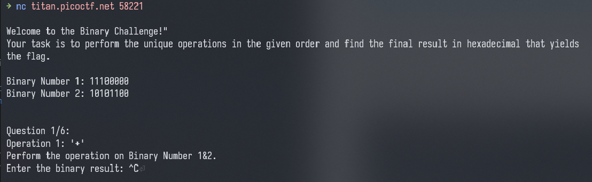


Đây là script của mình để solve bài này.
:::details solve.py
```python
from pwn import *

conn = remote("titan.picoctf.net", PORT)

conn.recvuntil(b"Your task is to perform the unique operations in the given order and find the final result in hexadecimal that yields the flag.\n\n")
bin1 = conn.recvline().decode().strip().split(" ")[3]
bin2 = conn.recvline().decode().strip().split(" ")[3]

def calc(bin1, bin2, ope, option):
    if (option == 0):
        return bin(eval(f"0b{bin1} {ope} 0b{bin2}"))[2:]
    elif (option == 1):
        return bin(eval(f"0b{bin1} {ope} 1"))[2:]
    else:
        return bin(eval(f"0b{bin2} {ope} 1"))[2:]

tmp = ""
for i in range(6):
    conn.recvuntil(b"Operation ")
    conn.recvuntil(b": ")

    ope = conn.recvline().decode().replace("'","").strip()
    res = conn.recvline()

    print(f"{bin1} {ope} {bin2}")
    conn.recvuntil(b"Enter the binary result: ")
    if (b"1&2" in res):
        res = calc(bin1, bin2, ope, 0)
        conn.sendline(res.encode())
    elif (b"Number 1" in res):
        res = calc(bin1, bin2, ope, 1)
        conn.sendline(res.encode())
    elif (b"Number 2" in res):
        res = calc(bin1, bin2, ope, 2)
        conn.sendline(res.encode())
    if (i == 5):
        tmp = res

conn.recvuntil(b"Enter the results of the last operation in hexadecimal: ")
conn.sendline(hex(int(tmp, 2)).encode())
conn.interactive()
```
:::

## GENERAL: dont-you-love-banners
:::info Challenge
Can you abuse the banner?
Additional details will be available after launching your challenge instance.
:::
Trước tiên ta cần trả lời một số câu hỏi đơn giản, sau khi trả lời xong sẽ được xài bash
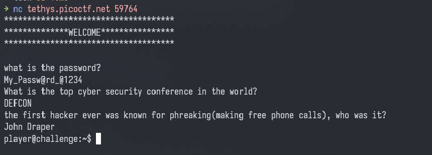

Kiểm tra thì thấy có script python đang chạy ở `/root`
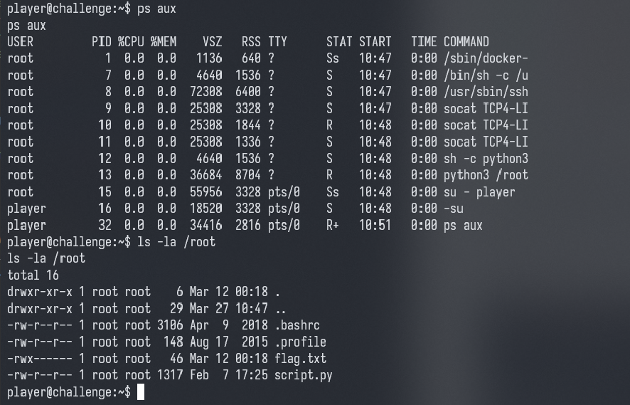
Ở đây có file `flag.txt` nhưng bị giới hạn quyền chỉ cho user `root` đọc file.

Còn có `script.py` của user `root`, cho phép ta đọc nội dung của file đó.
Đọc thử file `script.py` sẽ thấy code sẽ đọc nội dung từ file `/home/player/banner` và print ra khi chạy sript
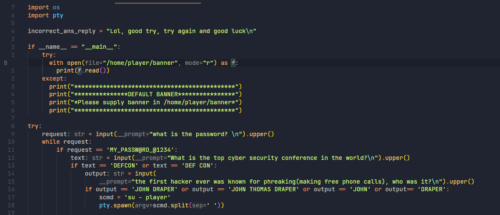

--> Ta có thể xài symlynk để khi đọc file `/home/player/banner` nó sẽ tự trỏ tới file `/root/flag.txt` để đọc và print ra.
Sau khi tạo symlink, kiểm tra sẽ thấy banner trỏ tới flag.txt
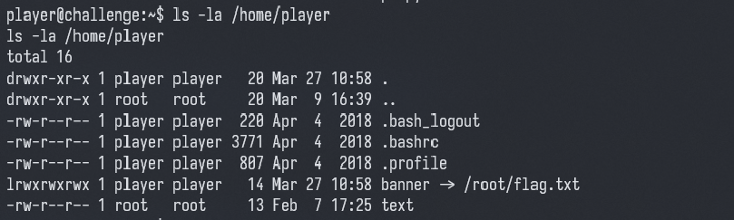
Bây giờ chỉ việc nc lại là có flag

> Bài này còn một cách khác là leo quyền lên root với password là `iloveyou` 🤨

## GENERAL: SansAlpha
:::info Challenge
The Multiverse is within your grasp! Unfortunately, the server that contains the secrets of the multiverse is in a universe where keyboards only have numbers and (most) symbols.
Additional details will be available after launching your challenge instance.
:::

Bài cho phép ta sử dụng command nhưng lại ban gần như hầu hết các kí tự alphabet, chỉ có thể xài số và các kí tự đặc biệt.
--> Mình nghĩ đến hướng sử dụng [wildcards](https://tldp.org/LDP/GNU-Linux-Tools-Summary/html/x11655.htm) để thay thế.

Trước tiên cần tìm flag file nằm đâu, sau khi fuzz thì mò ra nó nằm ở `blargh/flag.txt`
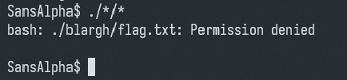

Tiếp theo ta cần tìm cách đọc file flag
Vì có thể xài ký tự số nên mình tìm các lệnh có chứa ký tự số có thể xài được 
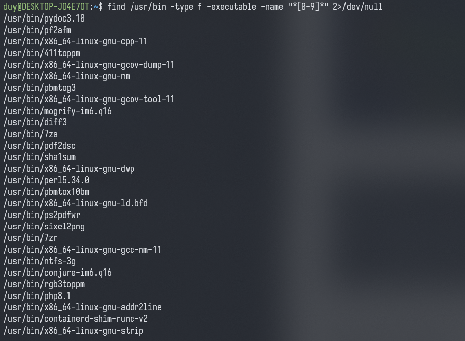

Ta thấy có base32 (base64) có thể xài được nên có thể sử dụng `/???/???/????32` để gọi đến `/usr/bin/base32` và đọc file
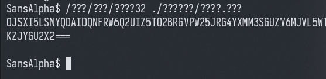

> Ngoài ra còn một số lệnh có thể sử dụng như `/usr/bin/diff3`, `/usr/bin/pdb3.8` (vì script chạy với python3.8)
> 
> Một cách làm khác khá hay từ người anh họ Hứa
> `"$(<./??????/????.???)"`


## WEB: No Sql Injection
:::info Challenge
Can you try to get access to this website to get the flag?
You can download the source [here](https://artifacts.picoctf.net/c_atlas/34/app.tar.gz).
The website is running [here](http://atlas.picoctf.net:53436/). Can you log in?
:::
App sử dụng database là MongoDB, khi POST `/login` sẽ gửi JSON gồm email và password cho server 
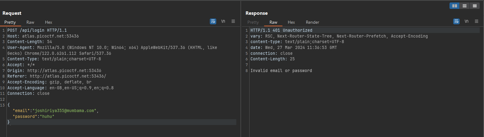

Query của MongoDB ta có thể thêm vào một object có key là `$regex` để match query thỏa điều kiện của regex đó.
Như thế, ta chỉ cần đưa vào email là `joshiriya355@mumbama.com` và password match `.*`.

Tuy nhiên nếu đưa object vào password sẽ bị lỗi, vì ở phần code xử lý sẽ check password bắt đầu bằng "{" và kết thúc bằng "}" là syntax của JSON, khi đó code sẽ tự parse string đó thành JSON object
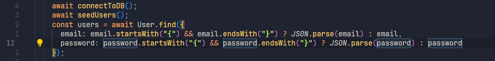

Giờ chỉ việc POST lên với password là JSON string sẽ được token, decode token và ra flag
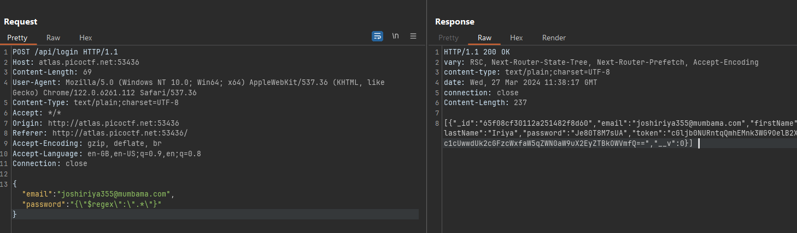

## WEB: Trickster
:::info Challenge
I found a web app that can help process images: PNG images only!
Additional details will be available after launching your challenge instance.
:::
Web cho phép upload hình ảnh lên, khi check `/robots.txt` ta thấy có 2 path là `/instructions.txt` và `/uploads/`. Folder upload là nơi sẽ chứa các file mình up lên server.

:::details /instructions.txt
Let's create a web app for PNG Images processing.
It needs to:
Allow users to upload PNG images

   **look for ".png" extension** in the submitted files

   make sure the **magic bytes match** (not sure what this is exactly but wikipedia says that the first few bytes contain 'PNG' in hexadecimal: "50 4E 47" )

After validation, store the uploaded files so that the admin can retrieve them later and do the necessary processing.
:::

Code sẽ check file có phải PNG hay không dựa vào
- File header 
- Tên file có chứa ".png"

Vì Backend sử dụng PHP/8.0.30, ta chỉ cần upload file php lên chạy hàm `shell_exec` để RCE
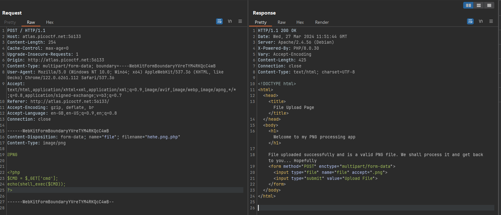

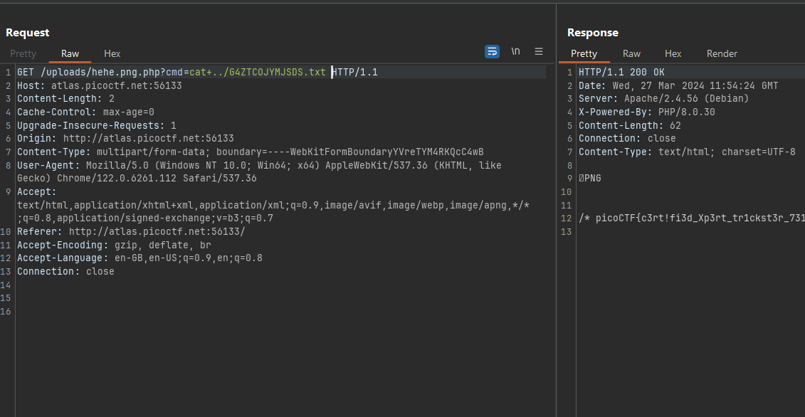
##

Check out mah teammates' blog: [@clowncs](https://clowncs.github.io/picoctf2024/), [s1gm4🦆](https://s19ma.github.io/posts/2024/picoCTF_2024.html)
